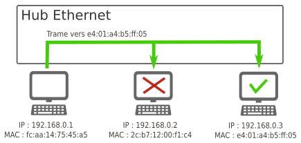
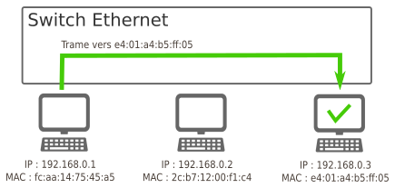
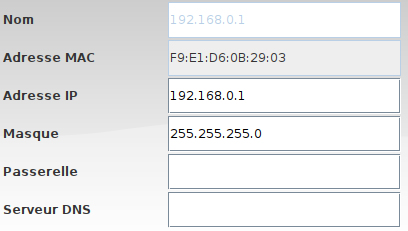
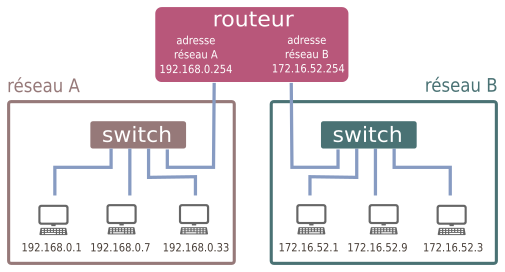
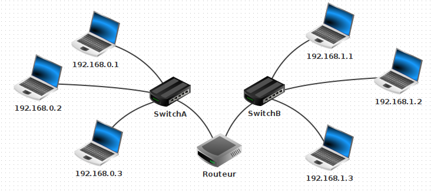

## Architecture d'un réseau


### 1. Premier réseau local

Au sein du logiciel [Filius](https://www.lernsoftware-filius.de/Herunterladen), créons le réseau local ci-dessous :


Testons le ```ping``` de la machine ```192.168.0.1```  vers la machine ```192.168.0.3```.

<details><summary> Résultat </summary>
<p>


</p>
</details>

<br>


Quels sont les différents composants et protocoles qui interviennent dans cette configuration ?

#### 1.1. La carte réseau et son adresse MAC
Chaque ordinateur sur le réseau dispose d'une adresse MAC, qui une valeur **unique** attribuée à sa carte réseau (Ethernet, Wifi, 4G, 5G, ...) lors de sa fabrication en usine.

Cette adresse est codée sur 48 bits, présentés sous la forme de 6 octets en hexadécimal. Exemple : ```fc:aa:14:75:45:a5```

Les trois premiers octets correspondent au code du fabricant.
Un site comme https://www.macvendorlookup.com/ vous permet de retrouver le fabricant d'une adresse MAC quelconque.

#### 1.2. Switch, hub, quelle différence ?

- Au sein d'un **hub Ethernet** (de moins en moins vendus), il n'y a **aucune analyse** des données qui transitent : il s'agit simplement d'un dédoublement des fils de cuivre (tout comme une multiprise électrique). L'intégralité des messages est donc envoyée à l'intégralité des ordinateurs du réseau, même s'ils ne sont pas concernés.



- Au sein d'un **switch Ethernet** , une analyse est effectuée sur la trame qui est à distribuer (voir la partie sur les différentes couches OSI). Lors d'un branchement d'un nouvel ordinateur sur le switch, celui-ci récupère son adresse MAC, ce qui lui permet de **trier** les messages et de ne les distribuer qu'au bon destinataire.



### 2. Un deuxième sous-réseau

Rajoutons un deuxième sous-réseau de la manière suivante (penser à bien renommer les switchs).


**Comment relier ces deux sous-réseaux ?**

Une réponse pas si bête : avec un cable entre les deux switchs !


1. Testons cette hypothèse en essayant de pinger la machine ```192.168.1.2``` depuis la machine ```192.168.0.1```. 
<details><summary> Résultat </summary>
<p>


Cela ne marche pas. Les paquets sont perdus.
</p>
</details>

<br>

2. Temporairement, renommons la machine ```192.168.1.2``` en ```192.168.0.33```. Testons à nouveau le ping depuis la machine ```192.168.0.1```.

<details><summary> Résultat </summary>
<p>


Cela marche. Les paquets sont bien acheminés.
</p>
</details>

<br>


**Intuition** : la notion de sous-réseau n'est pas *topologique* («il suffit de relier les ordinateurs entre eux») mais obéit à des règles numériques.

#### 2.1. Notion de masque de sous-réseau

Dans Filius, lors de l'attribution de l'adresse IP à une machine, une ligne nous permet de spécifier le **masque de sous-réseau** (appelé simplement « Masque » dans Filius). C'est ce masque qui va permettre de déterminer si une machine appartient à un sous-réseau ou non, en fonction de son adresse IP.



##### 2.1.1 Explication basique
- Si le masque est ```255.255.255.0```, toutes les machines partageant les mêmes **trois** premiers nombres de leur adresse IP appartiendront au même sous-réseau. Comme ceci est le réglage par défaut de Filius, cela explique pourquoi  ```192.168.0.33``` et ```192.168.0.1``` sont sur le même sous-réseau, et pourquoi  ```192.168.1.2``` et ```192.168.0.1``` ne sont pas sur le même sous-réseau.

Dans cette configuration, 256 machines peuvent donc appartenir au même sous-réseau (ce n'est pas tout à fait le cas car des adresses finissant par 0 ou par 255 sont réservées).

- Si le masque est ```255.255.0.0```, toutes les machines partageant les mêmes **deux** premiers nombres de leur adresse IP appartiendront au même sous-réseau.  
Dans cette configuration, 65536 machines peuvent être dans le même sous-réseau. (car 256^2=65536)


**Exercice**
- Renommons ```192.168.0.33``` en ```192.168.1.2``` et modifions son masque en ```255.255.0.0```.
- Modifions aussi le masque de ```192.168.0.1``` en ```255.255.0.0```.
- Testons le ping de ```192.168.0.1``` vers ```192.168.1.2```.

<details><summary> Résultat </summary>
<p>


Cela marche. Les deux machines appartiennent maintenant au même sous-réseau.
</p>
</details>

<br>

##### 2.1.2 Explication avancée

Lorsqu'une machine A veut envoyer un message à une machine B, elle doit déterminer si cette machine :
- appartient au même sous-réseau : auquel cas le message est envoyé directement via un ou plusieurs switchs.
- n'appartient pas au même sous-réseau : auquel cas le message doit d'abord transiter par un routeur (voir 3.)

Quelle opération permet de distinguer cette appartenance à un même sous-réseau ?

Appelons ```IP_A``` et ```IP_B``` les adresses IP respectives des machines A et B.  
Appelons ```M``` le masque de sous-réseau.  
Nommons ```&``` l'opérateur de conjonction entre nombres binaires (voir [ici](https://github.com/glassus/nsi/blob/master/Premiere/Theme03_Representation_des_donnees/05_Operateurs_booleens.ipynb)): 

**Propriété :** A et B appartiennent au même sous-réseau ⇔ ```IP_A & M = IP_B & M```

Exemple : considérons trois machines A, B, C d'IP respectives ```192.168.129.10```, ```192.168.135.200``` et ```192.168.145.1```, configurées avec un masque de sous-réseau égal à ```255.255.248.0```.  

|        | machine A      | machine B       | machine C     |
|--------|----------------|-----------------|---------------|
| IP     | 192.168.129.10 | 192.168.135.200 | 192.168.145.1 |
| M      | 255.255.248.0  |  255.255.248.0  | 255.255.248.0 |
| IP & M | 192.168.128.0  |  192.168.128.0  | 192.168.144.0 |

rappel des règles de calcul :
- pour tout octet ```x```, ```x & 255 = x```  et ```x & 0 = 0```.
- ```129 & 248``` s'écrit en binaire ```10000001 & 11111000``` qui vaut ```10000000```, soit ```128``` en décimal.

Conclusion : les machines A et B sont sous le même sous-réseau, mais pas la machine C.

##### 2.1.3 Cohérence entre les deux explications
Lorsqu'un masque de sous-réseau est égal à ```255.255.255.0```, l'opération de conjonction ```&``` avec chaque IP ne laissera intacts que les 3 premiers octets, le dernier sera égal à 0. Donc si deux adresses s'écrivent ```A.B.C.X``` et   ```A.B.C.Y```, elles appartiendront forcément au même sous-réseau (typiquement, c'est le cas de ```192.168.0.33``` et ```192.168.0.1```).

#### 2.2 Écriture des masques de sous-réseau : notation CIDR

D'après ce qui précède, 2 informations sont nécessaires pour déterminer le sous-réseau auquel appartient une machine : son IP et le masque de sous-réseau. 
Une convention de notation permet d'écrire simplement ces deux renseignements : la notation CIDR.

**Exemple** : Une machine d'IP ```192.168.0.33``` avec un masque de sous-réseau ```255.255.255.0``` sera désignée par ```192.168.0.33 / 24``` en notation CIDR.

Le préfixe ```/ 24``` signifie que le masque de sous-réseau commence par  24 bits consécutifs de valeur 1 : le reste des bits (donc 8 bits) est à mis à 0.  
Autrement dit, ce masque vaut ```11111111.11111111.11111111.00000000``` , soit ```255.255.255.0```.  
De la même manière, le préfixe ```/ 16``` donnera un masque de ```11111111.11111111.00000000.00000000``` , soit ```255.255.0.0```.  
Ou encore, un préfixe ```/ 21``` donnera un masque de ```11111111.11111111.11111000.00000000``` , soit ```255.255.248.0```. 


### 3. Un vrai réseau contenant deux sous-réseaux distincts : la nécessité d'un routeur

Notre solution initiale (relier les deux switchs par un cable pour unifier les deux sous-réseaux) n'est pas viable à l'échelle d'un réseau planétaire.

Pour que les machines de deux réseaux différents puissent être connectées, on va utiliser un dispositif équipé de **deux cartes réseaux**, situé à cheval entre les deux sous-réseaux. Ce équipement de réseau est appelé **routeur** ou **passerelle**.



#### 3.1 Principe de fonctionnement
Imaginons que la machine ```192.168.0.1 / 24``` veuille communiquer avec la machine  ```172.16.52.3 / 24```.  
L'observation du masque de sous-réseau de la machine ```192.168.0.1 / 24``` nous apprend qu'elle ne peut communiquer qu'avec les adresses de la forme ```192.168.0.X / 24```, où ```X``` est un nombre entre 0 et 255. 
- lorsque




---
**Bibliographie**
- Numérique et Sciences Informatiques, 1re, T. BALABONSKI, S. CONCHON, J.-C. FILLIATRE, K. NGUYEN, éditions ELLIPSES.
- OpenClassrooms : https://openclassrooms.com/fr/courses/1561696-les-reseaux-de-zero/3607286-ladressage-cidr


---


G.Lassus, Lycée François Mauriac --  Bordeaux  

- [ ] fekf
- [ ] fekf
- [ ] fekf
