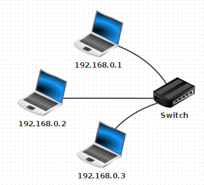
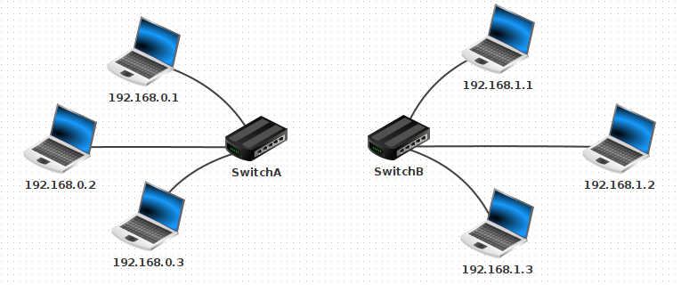
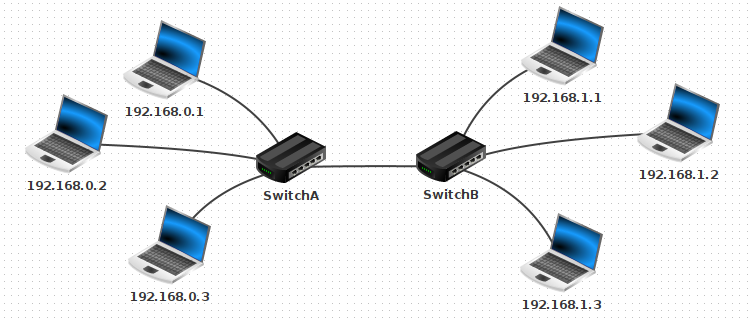

## Architecture d'un réseau


### 1. Premier réseau local

Au sein du logiciel [Filius](https://www.lernsoftware-filius.de/Herunterladen), créons le réseau local ci-dessous :



Testons le ```ping``` de la machine ```192.168.0.1```  vers la machine ```192.168.0.3```.

<details><summary> Résultat </summary>
<p>


</p>
</details>

<br>


Quels sont les différents composants et protocoles qui interviennent dans cette configuration ?

#### 1.1 La carte réseau et son adresse MAC
Chaque ordinateur sur le réseau dispose d'une adresse MAC, qui une valeur **unique** attribuée à sa carte réseau (Ethernet, Wifi, 4G, 5G, ...) lors de sa fabrication en usine.

Cette adresse est codée sur 48 bits, présentés sous la forme de 6 octets en hexadécimal. Exemple : ```fc:aa:14:75:45:a5```

Les trois premiers octets correspondent au code du fabricant.
Un site comme https://www.macvendorlookup.com/ vous permet de retrouver le fabricant d'une adresse MAC quelconque.

#### 1.2 Switch, hub, quelle différence ?

- Au sein d'un **hub Ethernet** (de moins en moins vendus), il n'y a **aucune analyse** des données qui transitent : il s'agit simplement d'un dédoublement des fils de cuivre (tout comme une multiprise électrique). L'intégralité des messages est donc envoyée à l'intégralité des ordinateurs du réseau, même s'ils ne sont pas concernés.


- Au sein d'un **switch Ethernet** , une analyse est effectuée sur la trame qui est à distribuer (voir la partie sur les différentes couches OSI). Lors d'un branchement d'un nouvel ordinateur sur le switch, celui-ci récupère son adresse MAC, ce qui lui permet de **trier** les messages et de ne les distribuer qu'au bon destinataire.


#### 1.3 Un deuxième sous-réseau

Rajoutons un deuxième sous-réseau de la manière suivante (penser à bien renommer les switchs).



**Comment relier ces deux sous-réseaux ?**

Une réponse pas si bête : avec un cable entre les deux switchs !



1. Testons cette hypothèse en essayant de pinger la machine ```192.168.1.2``` depuis la machine ```192.168.0.1```. 
<details><summary> Résultat </summary>
<p>


Cela ne marche pas. Les paquets sont perdus.
</p>
</details>

<br>

2. Temporairement, renommons la machine ```192.168.1.2``` en ```192.168.0.33```. Testons à nouveau le ping depuis la machine ```192.168.0.1```.

<details><summary> Résultat </summary>
<p>


Cela marche. Les paquets sont bien acheminés.
</p>
</details>

<br>


**Intuition** : la notion de sous-réseau n'est pas *topologique* («il suffit de relier les ordinateurs entre eux») mais obéit à des règles numériques.

#### 1.4 Notion de masque de sous-réseau

Dans Filius, lors de l'attribution de l'adresse IP à une machine, une ligne nous permet de spécifier le **masque de sous-réseau** (appelé simplement « Masque » dans Filius). C'est ce masque qui va permettre de déterminer si une machine appartient à un sous-réseau ou non, en fonction de son adresse IP.


##### 1.4.1 Explication basique
- Si le masque est ```255.255.255.0```, toutes les machines partageant les mêmes **trois** premiers nombres de leur adresse IP appartiendront au même sous-réseau. Comme ceci est le réglage par défaut de Filius, cela explique pourquoi  ```192.168.0.33``` et ```192.168.0.1``` sont sur le même sous-réseau, et pourquoi  ```192.168.1.2``` et ```192.168.0.1``` ne sont pas sur le même sous-réseau.

Dans cette configuration, 256 machines peuvent donc appartenir au même sous-réseau.

- Si le masque est ```255.255.0.0```, toutes les machines partageant les mêmes **deux** premiers nombres de leur adresse IP appartiendront au même sous-réseau.
Dans cette configuration, 65536 machines peuvent être dans le même sous-réseau. (car $256^2=65536$)


**Exercice**
- Renommons ```192.168.0.33``` en ```192.168.1.2``` et modifions son masque en ```255.255.0.0```.
- Modifions aussi le masque de ```192.168.0.1``` en ```255.255.0.0```.
- Testons le ping de ```192.168.0.1``` vers ```192.168.1.2```.

<details><summary> Résultat </summary>
<p>


Cela marche. Les deux machines appartiennent maintenant au même sous-réseau.
</p>
</details>

<br>
