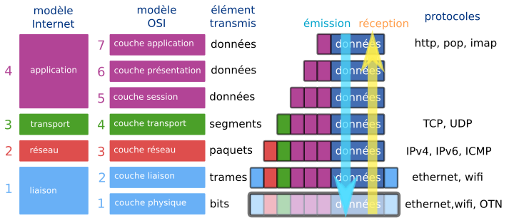
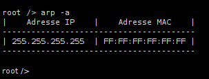
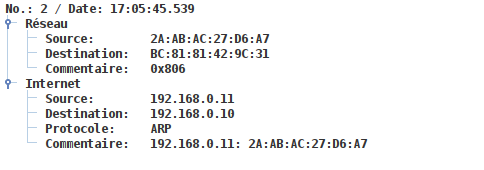
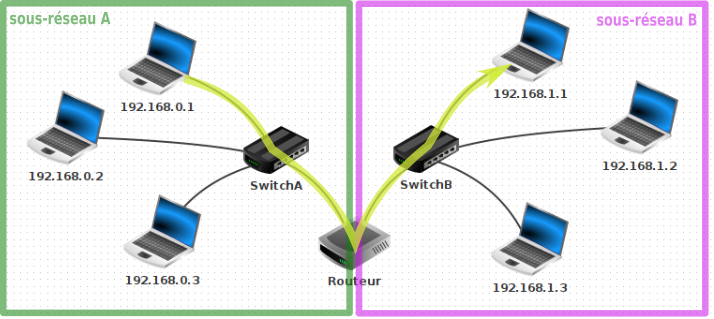
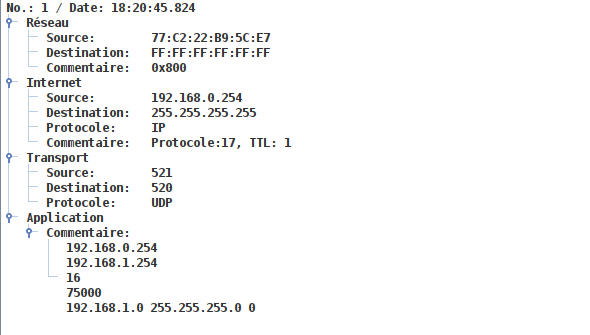
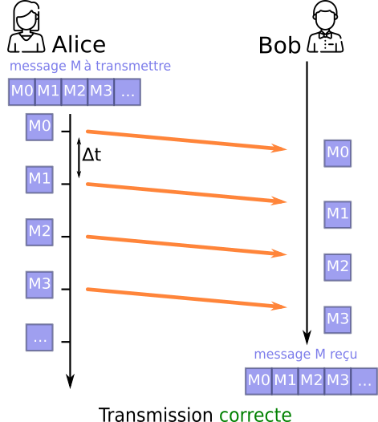

# Protocoles de communication dans un réseau

## I. Modèle OSI, modèle Internet


Les bits transmis d'un ordinateur à un autre contiennent, en plus des données _utiles_ (le mot «bonjour» dans un email), une multitude de données (tout aussi utiles) qui vont aider à l'acheminement de ces bits au bon endroit, puis au bon ordinateur, puis au bon logiciel. 
Les différents protocoles qui régissent cette transmission sont regroupés dans ce qui est appelé un **modèle**. Deux modèles synthétisent ces protocoles :
- le **modèle Internet** (ou modèle **TCP/IP**, 1974), organisé en **4** couches : liaison, réseau, transport, application.
- le **modèle OSI** (Open Systems Interconnection, 1984), organisé en **7** couches : physique, liaison, réseau, transport, session, présentation,application.

Ces deux modèles coïncident suivant le schéma ci-dessus. Ce sont des modèles théoriques et d'une certaine rigidité. Leur utilisation dans la pratique est parfois plus floue, avec des protocoles à cheval sur plusieurs couches.  
Dans la suite de ce cours, nous évoquerons les couches par leur numéro dans le modèle OSI.




Lors de son émission, un message va subir successivement toutes les transformations effectuées par chaque couche, depuis sa création (couche 7) jusqu'à sa transmission physique (couche 1).  

Lorsque ce même message sera réceptionné, les transformations seront effectuées dans l'ordre inverse, jusqu'à la présentation du message au destinataire.

- **couches 7-6-5  — couches application-présentation-session :** 
Ces couches (réunies dans le modèle Internet en une couche unique «application» ) regroupent les protocoles nécessaires à la bonne mise en forme d'un message (au sens large) avant sa transmission. Ces protocoles peuvent être de nature très différente : protocole HTTP pour la transmisson de pages web, protocole FTP pour le transfert de fichiers, protocoles POP ou IMAP pour le courrier électronique...
</br>

- **couche 4 — couche transport :**   
Le protocole majeur de cette couche est le protocole TCP :
    - il s'assure par SYN-ACK que l'émetteur et le récepteur sont prêts à échanger des messages. 
    - il découpe en segments numérotés le message à transmettre (côté émetteur) ou bien recompose le message total en remettant les segments dans l'ordre (côté récepteur).    
Les éléments échangés avec la couche inférieure sont des **segments**.
</br>

- **couche 3 — couche réseau :**  
C'est la couche où chaque segment numéroté est encapsulé dans un paquet qui, suivant le protocole IP, va contenir son adresse source et son adresse de destination. C'est à ce niveau que se décide si le message doit rester dans le réseau local ou être envoyé sur un autre réseau via la passerelle du routeur.  
Les éléments échangés avec la couche inférieure sont des **paquets**.
</br>

- **couche 2 — couche liaison :**  
C'est l'encapsulation finale du message. Suivant le protocole Ethernet, les informations sont transmises d'une carte réseau à une autre, grâce à leur adresse MAC (Media Access Controler).  
Les éléments échangés avec la couche inférieure sont des **trames**.
</br>

- **couche 1 — couche physique :**  
C'est la couche où le message est transmis physiquement d'un point à un autre. Par signal lumineux (fibre optique), par ondes (wifi), par courant électrique (Ethernet)... Les éléments transmis sont les **bits**. 

 


Lors de son parcours, une trame peut être partiellement décapsulée et remonter à la couche 3, avant de redescendre et de continuer son chemin. C'est le cas notamment lors du passage dans un routeur. Mais jamais, lors de son acheminement, le contenu réel du message n'est ouvert : les paquets transmis sont acheminés de manière identique, qu'ils contiennent les éléments constitutifs d'une vidéo YouTube ou d'un email à votre cousin.  
Ce principe fondateur, actuellement menacé par certains acteurs politiques et industriels, est connu sous l'expression **«la neutralité du net»**.


## II. Observation des trames avec Filius

### 1. Ping à travers un switch
Vous pouvez télécharger le fichier [ping_switch.fls](data/ping_switch.fls).

- Relions une machine ```192.168.0.10``` d'adresse MAC ```BC:81:81:42:9C:31```  à une machine ```192.168.0.11``` d'adresse MAC ```2A:AB:AC:27:D6:A7``` à travers un switch.  
 
 

- Observons la table SAT de notre switch : elle est vide, car aucune machine n'a encore cherché à communiquer.  

 

- Lançons un ping depuis ```192.168.0.10``` vers ```192.168.0.11``` et observons les données échangées :   

  

- Observons de plus près la première ligne de données échangées.  

   

Cette première ligne est une requête **ARP**. ARP est un protocole qui s'interface entre la couche 3 / réseau (appelée dans la capture d'écran _Internet_)  et la couche 2 / liaison (appelée dans la capture d'écran _Réseau_). Comme indiqué dans le commentaire, elle consiste à un appel à tout le réseau : "Est-ce que quelqu'un ici possède l'IP ```192.168.0.11``` ?

**Message 1 : « Qui possède l'IP ```192.168.0.11``` ? »**

Il faut comprendre à cette étape que l'adresse IP est totalement inutile pour répérer un ordinateur dans un sous-réseau. Ce sont les adresses MAC qui permettent de se repérer dans un sous-réseau. Les adresses IP, elles, permettront éventuellement d'acheminer le message jusqu'au bon sous-réseau (elles n'intéressent donc que les routeurs).


Revenons à notre ping vers ```192.168.0.11```.

La commande ```arp -a``` effectuée dans un terminal de la machine ```192.168.0.10``` nous permet de voir qu'elle ne connaît encore personne dans son sous-réseau. La table de correspondance IP ⮀ MAC ne contient que l'adresse de broadcast ```255.255.255.255```, qui permet d'envoyer un message à tout le réseau.  
 

Constatant qu'elle ne sait pas quelle est l'adresse MAC de ```192.168.0.11```, la machine ```192.168.0.10``` commence donc par envoyer un message à **tout** le sous-réseau, par l'adresse MAC de broadcast ```FF:FF:FF:FF:FF:FF```. Le switch va lui aussi lui aussi relayer ce message à tous les équipements qui lui sont connectés (dans notre cas, un seul ordinateur) 


**Message 2 : « Moi ! »**  

La machine ```192.168.0.11``` s'est reconnu dans le message de broadcast de la machine ```192.168.0.10```. Elle lui répond pour lui donner son adresse MAC.  

 

À partir de ce moment, la machine ```192.168.0.10``` sait comment communiquer avec ```192.168.0.11```. Elle l'écrit dans sa table ```arp```, afin de ne plus avoir à émettre le message n°1 :  

 


Le switch, qui a vu passer sur ses ports 0 et 1 des messages venant des cartes MAC ```BC:81:81:42:9C:31```  et ```2A:AB:AC:27:D6:A7```, peut mettre à jour sa table SAT :  

 

Par la suite, il saura sur quel port rediriger les messages destinés à ces deux adresses MAC. Un switch est un équipement de réseau de la couche 2 du modèle OSI, il ne sait pas lire les adresses IP : il ne travaille qu'avec les adresses MAC.

**Message 3 : le ping est envoyé**

 

Schématisons cette trame Ethernet (couche 2 du modèle OSI) :

 

**Message 4 : le pong est retourné**

 


 


### 2. Ping à travers un routeur

Vous pouvez télécharger le fichier [ping_routeur.fls](data/ping_routeur.fls).

 

L'objectif est d'observer les différentes trames lors d'un ping entre :
- la machine ```192.168.0.1 / 24``` (adresse MAC ```F9:E1:D6:0B:29:03``` ) et
- la machine ```192.168.1.1 / 24``` (adresse MAC ```D3:79:96:B8:5C:A4``` )

Le routeur est configuré ainsi :
- interface sur le réseau A :
    - IP : ```192.168.0.254``` 
    - MAC : ```77:C2:22:C9:5C:E7``` 
- interface sur le réseau B :
    - IP : ```192.168.1.254``` 
    - MAC : ```66:E5:4E:7D:0B:B0``` 


**Étape 0 : le routeur signale sa présence**

Lors de l'observation des messages reçus ou émis par la machine ```192.168.0.1```, on peut être intrigué par ce tout premier message reçu, émis par le routeur : 

 

On peut y distinguer les 4 couches du modèle Internet. Le routeur, par ce message distribué à tous les éléments du sous-réseau A (il envoie un message équivalent sur son sous-réseau B), déclare sa présence, et le fait qu'il possède deux interfaces, une pour chaque réseau. 
Il se positionne ainsi comme une passerelle : «c'est par moi qu'il faudra passer si vous voulez sortir de votre sous-réseau». 
Dans cette trame envoyée figure son adresse MAC, de sorte que tous les membres de son sous-réseau pourront donc communiquer avec lui.


**Étape 1 : de ```192.168.0.1``` vers le routeur**

La machine ```192.168.0.1 / 24``` calcule que la machine ```192.168.1.1 / 24``` avec laquelle elle veut communiquer n'est **pas** dans son sous-réseau (voir [ce cours)](./03_Architecture_reseau.md).  
Elle va donc envoyer son message à sa passerelle, qui est l'adresse du routeur dans son sous-réseau. 

Cette première trame est :

 


**Étape 2 : le routeur décapsule la trame**

Le routeur est un équipement de réseau de couche 3 (couche réseau). Il doit observer le contenu du paquet IP (sans remonter jusqu'au contenu du message) pour savoir, suivant le procédé de **routage** (voir cours de Terminale), où acheminer ce paquet.

Dans notre cas, l'adresse IP ```192.168.1.1```de destination lui est accessible : elle fait partie de son sous-réseau B.

Le routeur va modifier la valeur du TTL (Time To Live), en la décrémentant de 1. Si, après de multiples routages, cette valeur devenait égale à 0, ce paquet serait détruit. Ceci a pour but d'éviter l'encombrement des réseaux avec des paquets ne trouvant pas leur destination.

Remarque : 
    dans notre cas, le routeur va laisser intacte l'adresse IP Source. Ce n'est pas toujours le cas. Dans le cas classique de la box qui relie votre domicile à internet, le routeur contenu dans celle-ci va remplacer l'adresse locale de votre ordinateur ou smartphone (ex ```192.168.0.26```) par son IP publique (celle apparaissant sur [whatsmyip.com](http://whatsmyip.com), par exemple). Elle effectue ce qu'on appelle une translation d'adresse (NAT). 
    Pourquoi ? Parce que sinon la réponse du serveur distant que vous interrogez serait envoyée sur une adresse locale (votre adresse ```192.168.0.26```), qui est introuvable depuis un réseau extérieur. Il faut donc remplacer toutes les adresses locales par l'IP publique de votre box.
    Pour éviter que la réponse du serveur web que vous avez interrogé ne soit affichée sur l'ordinateur de vos parents, le routeur affecte des ports différents à chaque machine de son sous-réseau. Ce port est inclus dans le message transmis au serveur, et il l'est aussi dans sa réponse : le routeur peut donc rediriger le trafic vers la bonne machine du sous-réseau.

Le routeur va ré-encapsuler le paquet IP modifié, et créer une nouvelle trame Ethernet en modifiant :
- l'adresse MAC source : il va mettre l'adresse MAC de son interface dans le sous-réseau B.
- l'adresse MAC de destination : il va mettre l'adresse MAC de ```192.168.1.1 ``` (qu'il aura peut-être récupérée au préalable par le protocole ARP)

Cette deuxième trame est donc :

 

On peut observer dans Filius cette trame, en se positionnant sur l'interface ```192.168.1.254 ``` du routeur, ou sur ```192.168.1.1 ``` :

 


En suivant le même principe, la machine ```192.168.1.1 ``` pourra envoyer son _pong_.


## III. Protocole du bit alterné
### 1. Contexte
- Alice veut envoyer à Bob un message M, qu'elle a prédécoupé en sous-messages M0, M1, M2,...
- Alice envoie ses sous-messages à une cadence Δt fixée.

### 2. Situation idéale

 


<br>

---
**Bibliographie**
- Numérique et Sciences Informatiques, 1re, T. BALABONSKI, S. CONCHON, J.-C. FILLIATRE, K. NGUYEN, éditions ELLIPSES.
- Prépabac NSI 1ère, C.ADOBET, G.CONNAN, G. ROZSAVOLGYI, L.SIGNAC, éditions Hatier.
- Cours d'OpenClassrooms : 
    - https://openclassrooms.com/fr/courses/857447-apprenez-le-fonctionnement-des-reseaux-tcp-ip/854659-le-routage
    - https://openclassrooms.com/fr/courses/1561696-les-reseaux-de-zero/3607286-ladressage-cidr


---


G.Lassus, Lycée François Mauriac --  Bordeaux  
