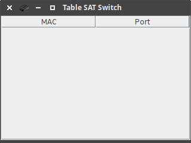
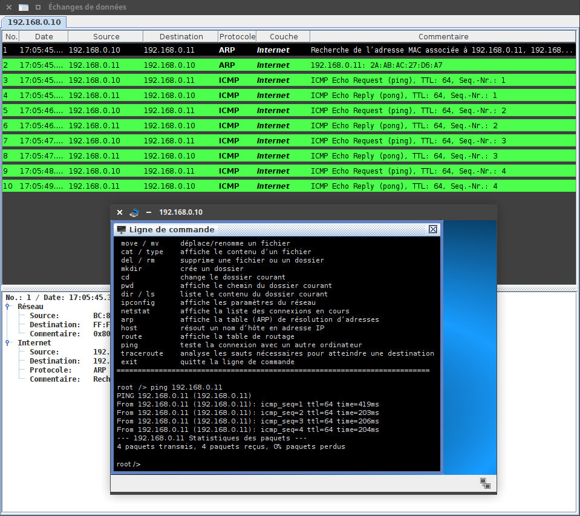

# Protocoles de communication dans un réseau

## I. Modèle OSI, modèle Internet


Les bits transmis d'un ordinateur à un autre contiennent, en plus des données _utiles_ (le mot «bonjour» dans un email), une multitude de données (tout aussi utiles) qui vont aider à l'acheminement de ces bits au bon endroit, puis au bon ordinateur, puis au bon logiciel. 
Les différents protocoles qui régissent cette transmission sont regroupés dans ce qui est appelé un **modèle**. Deux modèles synthétisent ces protocoles :
- le **modèle Internet** (ou modèle **TCP/IP**, 1974), organisé en **4** couches : liaison, réseau, transport, application.
- le **modèle OSI** (Open Systems Interconnection, 1984), organisé en **7** couches : physique, liaison, réseau, transport, session, présentation,application.

Ces deux modèles coïncident suivant le schéma ci-dessus. Dans la suite de ce cours, nous évoquerons les couches par leur numéro dans le modèle OSI.

Lors de la préparation d'un message à envoyer (une requête GET, par exemple), cette requête va successivement être **encapsulée** en descendant à travers chaque couche.  
La trame qui est émise par l'ordinateur émetteur du message sera partiellement décapsulée au cours de son parcours sur le réseau, notamment lors du passage à travers les switchs (équipements de réseau travaillant sur la couche 2 / liaison, avec les adresses MAC), ou bien à travers les routeurs (équipements de réseau travaillant sur la couche 3 /réseau, avec les adresses IP), avant d'être totalement décapsulés lors de la réception par l'ordinateur destinataire.

## II. Observation des trames avec Filius

### 1. Ping à travers un switch
- Relions une machine ```192.168.0.10``` d'adresse MAC ```A6:93:FC:76:76:D1```  à une machine ```192.168.0.11``` d'adresse MAC ```AF:0B:C7:58:27:32``` à travers un switch.  

- Observons la table SAT de notre switch : elle est vide, car aucune machine n'a encore cherché à communiquer.  
 
- Lançons un ping depuis ```192.168.0.10``` vers ```192.168.0.11``` et observons les données échangées :  
 