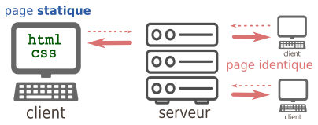

# Pages web et interactions

### 1. Le cas le plus simple : la même page pour tout le monde



Nous allons tout d'abord considérer le cas où le serveur renvoie une page unique, identique pour tous les utilisateurs. De plus, l'utilisateur ne pourra pas agir sur sa page : il n'y a aucune interactivité.

Exemple de page statique côté serveur et côté utilisateur :
- cette [merveille](http://glassus1.free.fr/interesting.html) de page web.
- plus complète, mais toute aussi statique : cette page [Wikipedia](https://fr.wikipedia.org/wiki/John_Horton_Conway) consacrée à John Conway.

#### 1.1 HTML pur

Lorsque le client demande au serveur le contenu d'une page web, celui-ci lui renvoie, dans le cas le plus simple, une simple page html.  
HTML est un langage dit « à balises ».  Ce n'est pas à proprement parler un langage de programmation, mais plutôt un langage de description de contenu. 
Il a été inventé en 1992 par [Tim Berners-Lee](https://fr.wikipedia.org/wiki/Tim_Berners-Lee). La version actuellement utilisée est le html5.

**Exemple de page web minimale**

```html
<!DOCTYPE html>
<html lang='fr'>
    <head>
        <metacharset="utf-8">
        <title>Un titre très original</title>
    </head>

    <body>
        <p>Ceci est le texte introductif de ma page.</p>
        <p>
           <h1>  Ceci est un titre de niveau 1 </h1>
           Mais sans rien d'intéressant.
           <h2>  Ceci est un titre de niveau 2 </h2>
              <ul>
                  <li> le début d'une liste indentée </li>
                  <li> la suite ... </li>
              </ul>  
        Pour apprendre le fonctionnement des balises, voir <a href="https://developer.mozilla.org/fr/docs/Apprendre/HTML/Introduction_%C3%A0_HTML/Getting_started"> ici</a> par exemple !
        </p>
    </body>
</html>

```

Vous pouvez contempler [ici](https://exemplehtmlpur--g-lassus.repl.co) le rendu de cette magnifique page.

##### Exercice 1
- Allez sur https://repl.it/ , identifiez-vous, et créez un nouveau Repl.it en choisissant HTML,CSS,JS.
- Créez une page contenant une image et un lien vers le site du lycée.


#### 1.2 HTML + CSS

Lors de la création de votre page sur Repl.it, vous avez pu voir dans l'explorateur de fichiers un fichier nommé ```style.css```.
L'acronyme CSS signifie _Cascading Style Sheets_. L'idée est de regrouper dans un seul fichier toutes les informations relatives à la mise en forme des éléments de la page html. 
De manière très simplifiée, on peut dire que le fichier ```html``` s'occupe _du fond_ tandis que le fichier ```css``` s'occupe de la _forme_.

Le fichier CSS (souvent nommé ```style.css```) doit être appelé au début du fichier ```html``` , au sein de la balise ```<head>```.

**Exemple minimal de couple html/css** :

- fichier ```index.html``` : 
```html
<!DOCTYPE html>
<html>
  <head>
    <meta charset="utf-8">
    <title>page test</title>
    <link href="style.css" rel="stylesheet" type="text/css" />
  </head>
    <body>
         <p>
           <h1>  Ceci est un titre de niveau 1 </h1>
           Mais sans rien d'intéressant.
           <h2>  Ceci est un titre de niveau 2 </h2>
        </p>
    </body>
</html>
```

- fichier ```style.css``` :

```css
html {
    font-size: 15px;
    font-family:  sans-serif;
    background-color: lightgray; 
  }

h1 {
	color: red;
}


```

Vous pouvez contempler [ici](https://exemplehtmlcss--g-lassus.repl.co) le nouveau rendu de cette encore plus magnifique page.


### 2. Quand le client peut agir sur sa page : exemple avec Javascript


### 3. Quand la page est fabriquée à la demande pour le client : exemple avec PHP


