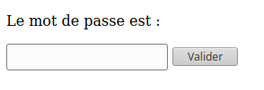

# Formulaires

## Comment envoyer des paramètres à un serveur ?

### Méthode GET

Considérons le formulaire suivant, inclus dans une page html ouverte dans le navigateur du client :

```html
Le mot de passe est :
<form action="cible2.php" method="get">
<p>
    <input type="password" name="pass" />
    <input type="submit" value="Valider" />
</p>
</form>
```

**Aperçu :**



**Explications :**
- le fichier ```cible2.php``` est le fichier sur le serveur qui recevra les paramètres contenus dans le formulaire.
- le premier paramètre sera nommé ```pass``` et sera de type ```password```, ce qui signifie qu'on n'affichera pas les caractères tapés par l'utilisateur.
On aurait pu aussi avoir un type :
    - ```text``` : le texte s'affiche en clair (pour les login par ex) 
    - ```radio``` : pour une sélection (d'un seul élément)
    - ```checkbox``` : pour une sélection (éventuellement multiple)